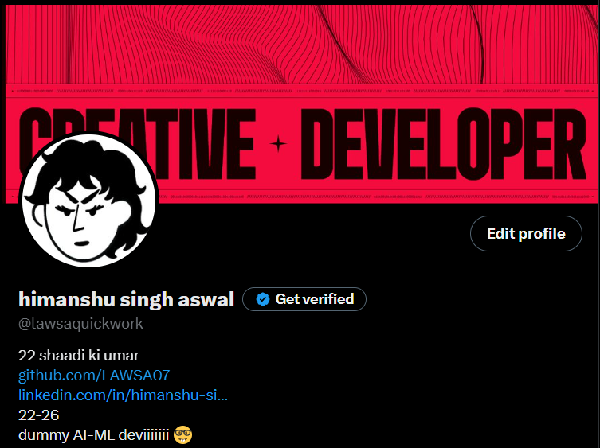

# 👋 Hi, I'm Himanshu Aswal (LAWSA07)

> **Final-year B.Tech CSE student | AI & ML | Web Development**

---

```
TypeScript   19 hrs 4 mins  ████████████████████████▓   98.97 %
PYTHON       11 mins        ▒░░░░░░░░░░░░░░░░░░░░░░░░   00.95 %
C++           1 hrs         ░░░░░░░░░░░░░░░░░░░░░░░░░   00.04 %
JSX           0 secs        ░░░░░░░░░░░░░░░░░░░░░░░░░   00.04 %
Markdown      0 secs        ░░░░░░░░░░░░░░░░░░░░░░░░░   00.00 %
```

---

## 📝 About

Passionate about designing intelligent solutions and building efficient web applications. Specialized in AI & Machine Learning and Web Development. Always eager to learn and create impactful technology.

---

## ✨ Features
- AI & ML project experience
- Web development expertise
- Open source contributor
- Efficient, clean code
- Strong focus on user experience

---

## 🛠️ Tech Stack

<p>
  
  
  
  
  
  
  
  
  
  
  
  
  
  
  
  
  
  
  
  
  
</p>

<!-- Note: For truly animated/movable icons, you would need to use GIFs or SVGs with animation, but GitHub markdown only supports static badge images. For more interactivity, consider linking to a portfolio or using a custom web page. -->

---

## 📂 Projects

| Project | Description | Stack |
|--------|-------------|-------|
| 🤖 [DeepFake-Detection](https://github.com/LAWSA07/DeepFake-Detection) | Detects deepfake media using advanced AI models.<br>Features real-time video analysis, robust detection pipeline, and user-friendly reporting. | Python |
| 💊 [medResAI](https://github.com/LAWSA07/medResAI) | End-to-end web solution for drug discovery predictions.<br>Integrates AI-driven analytics, molecular property prediction, and interactive dashboards for researchers. | Machine Learning |
| 📚 [Assignment-Plagarism-Detection](https://github.com/LAWSA07/Assignment-Plagarism-Detection) | Detects plagiarism in assignments/exams with zero false positives.<br>Supports multiple file formats, instant similarity scoring, and detailed result breakdowns. | JavaScript |
| ⚙️ [LAWSA-Automation](https://github.com/LAWSA07/LAWSA-Automation) | No-code agentic web automation platform.<br>Automates repetitive browser tasks, supports custom workflows, and offers a drag-and-drop interface. | Python |
| 🧑‍💼 [Co-PILOT](https://github.com/LAWSA07/Co-PILOT) | Smart interview & meeting assistant for productivity.<br>Provides real-time transcription, AI-powered note-taking, and actionable meeting summaries. | Python |
| 🧠 [CompileAI](https://github.com/LAWSA07/CompileAI) | AI-based C compiler and smart IDE.<br>Features code refactoring, syntax highlighting, one-click compilation, assembly viewer, and educational tools for learning compiler concepts. | C, JavaScript, HTML |
| 📊 [JOBIFY](https://github.com/LAWSA07/JOBIFY) | Job tracking app.<br>Web dashboard for managing job applications, status tracking, and analytics. | JavaScript, CSS, HTML |
| 🪪 [ProFel](https://github.com/LAWSA07/ProFel) | AI-powered digital profile analyzer for developers.<br>Aggregates and analyzes GitHub, LinkedIn, and coding platform profiles, provides skill insights, and matches to jobs. | Python, JavaScript, Flask, React |

---

## 📈 GitHub Stats


---


---

## 🤝 Contributing

Contributions, issues, and feature requests are welcome! Feel free to check the [issues page](https://github.com/LAWSA07/Lawsa07/issues) or submit a pull request.

---

## 📜 License

This project is licensed under the [MIT License](LICENSE).

---

## 📫 Contact

<p align="center">
  <a href="https://github.com/LAWSA07/Lawsa07"></a>
  <a href="https://github.com/LAWSA07/Lawsa07"></a>
  <a href="https://github.com/LAWSA07/Lawsa07/blob/main/LICENSE"></a>
  <a href="https://github.com/LAWSA07"></a>
</p>

[](https://www.linkedin.com/in/himanshu-singh-aswal-093186271/)
[](https://twitter.com/himanshuaswal)
[](mailto:aswalh0707@gmail.com)

---

## 🙏 Credits

Thanks to all contributors, open source libraries, and the GitHub community for inspiration and support.
